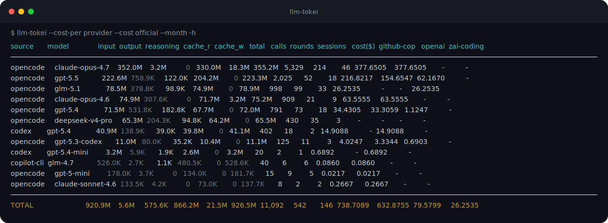

# llm-tokei

[](https://github.com/agentic-rs/llm-tokei/actions/workflows/ci.yml)
[](https://crates.io/crates/llm-tokei)
[](https://docs.rs/llm-tokei)
[](LICENSE)
[](Cargo.toml)
[](docs/usage.md)

See where your local coding-agent tokens went.

Website: [agentic-rs.github.io/llm-tokei](https://agentic-rs.github.io/llm-tokei/)

`llm-tokei` scans the session files already on your machine and turns them into
fast, grouped usage reports: input, output, reasoning, cache tokens, sessions,
turns, and estimated cost.

```sh
llm-tokei --cost-per provider --cost official --month -h
```



## Why Use It

- **One report across agents**: Codex CLI, OpenCode, Claude Code, GitHub Copilot Chat, and GitHub Copilot CLI.
- **Useful default table**: grouped by source and model, with cost columns included.
- **Time windows that match how people ask**: `--24h`, `--7d`, `--1m`, `--today`, `--week`, `--month`.
- **Cost visibility**: bundled prices from models.dev plus local overrides for subscriptions, multipliers, and custom rates.
- **Table and automation output**: readable terminal tables or stable JSON for scripts.
- **Replayable transcripts**: dump Codex and Copilot sessions into JSONL message streams.
- **Safe local reads**: parses local files and opens OpenCode's SQLite database read-only.

## Install

```sh
cargo install --path .
```

Or build a local binary:

```sh
cargo build --release
./target/release/llm-tokei --help
```

## Quick Examples

```sh
# Default report: source x model
llm-tokei

# Human-readable numbers for this week
llm-tokei --week -h

# Last 24 hours by project
llm-tokei --24h --group-by project,source,model

# Top expensive sessions in the last 7 days
llm-tokei --7d --group-by session,source,model --sort cost --limit 10

# Daily trend for the current month
llm-tokei --month --group-by date,source --date-bucket day

# JSON for scripts
llm-tokei --7d --format json --group-by source,model,project

# Show input/output as bytes instead of tokens
llm-tokei --bytes

# Dump replayable messages
llm-tokei dump --codex ~/.codex/sessions/2026/05/12/rollout-example.jsonl
llm-tokei dump --copilot --out ./sessions-jsonl
```

## Supported Sources

| Source | Default location |
| --- | --- |
| Codex CLI | `$CODEX_HOME/sessions` or `~/.codex/sessions` |
| OpenCode | `$OPENCODE_DATA_DIR/opencode.db`, `$XDG_DATA_HOME/opencode/opencode.db`, or `~/.local/share/opencode/opencode.db` |
| Claude Code | `$CLAUDE_HOME/projects` or `~/.claude/projects` |
| GitHub Copilot Chat | VS Code, Insiders, VSCodium, and Cursor `workspaceStorage` roots |
| GitHub Copilot CLI | `~/.copilot/session-state` |

Use `--source` and source path flags to narrow or override discovery.

## Learn More

Read the full usage guide: [docs/usage.md](docs/usage.md).

The guide covers config defaults, periods, filters, grouping, table fitting,
JSON output, pricing overrides, token semantics, source caveats, caching, and
the `dump` subcommand.

To regenerate the showcase SVG from real CLI output:

```sh
cargo run --example gen-showcase -- --args "--cost-per provider --cost official --month -h" --out docs/assets/showcase.svg
```
